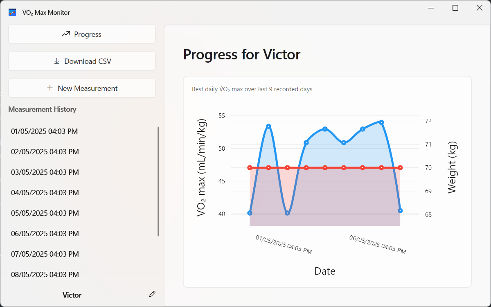

# V̇O₂ Max Monitor


Cross-platform desktop application for monitoring and tracking V̇O₂ max measurements from fitness devices, inspired by [rabbitcreek's Accurate VO2 Max for Zwift and Strava](https://www.instructables.com/Accurate-VO2-Max-for-Zwift-and-Strava/).


## Features

### User-Friendly and modern UI
- Intuitive navigation with a sidebar menu
- Automatically switches between light and dark themes based on system settings.
- Follows Microsoft Fluent Design principles for a modern look and feel.

### Measurement Management
- Create new V̇O₂ max measurements from CSV files containing raw sensor data.
- View a detailed measurement history
- Delete unwanted measurements

### Data Visualization



- Line charts with V̇O₂ max trends
- Weight (bodymass) tracking
- Up to 30-day performance overview

### Profile System
- Multiple user profiles with individual measurement histories
- Profile-specific tracking
- Easy switching between profiles

### MQTT Integration
- Download measurements directly from MQTT brokers
- Configurable connection settings (broker, port, topic, credentials)
- CSV file generation from live data

## Technical Overview

The application implements a V̇O₂ max calculation algorithm inspired by [rabbitcreek](https://www.instructables.com/Accurate-VO2-Max-for-Zwift-and-Strava/)'s work but designed for desktop use with collected raw data. The computation uses:

1. **Bernoulli's equation** for airflow calculations through a venturi tube
2. **Haldane's transformation** for accurate oxygen consumption computation
3. **Time-based integration** of measurements for precise results

### Device Compatibility

As previously mentioned, this app is designed to work with a (currently) hypothetical device based on the [Accurate VO2 Max for Zwift and Strava](https://www.instructables.com/Accurate-VO2-Max-for-Zwift-and-Strava/) project, which uses a Venturi tube to measure airflow and oxygen concentration. However, unlike the original project, devices compatible with *V̇O₂ Max Monitor* are not expected to do any on-device calculations. Instead, their raw readings (and details) must be collected (through either a CSV file, or an MQTT broker, more on that below) and processed by this application to compute V̇O₂ max values.

If no such device is available, the app can be tested with a simulator that generates synthetic readings based on the expected data format. **[Fake Athlete](https://gist.github.com/VictorPLopes/febac0231d3737dbafaff2204a1819d1) is one such simulator** that can be used to generate highly configurable CSV files with the required structure or MQTT messages that can be used to test the app's functionality.

### Expected Data Format

The app expects readings following this structure (as defined in the `Reading` struct):

```cs
public readonly record struct Reading(
    double VenturiAreaRegular,     // Cross-sectional area before constriction (m²) - THIS VALUE MUST BE CONSTANT ACROSS ALL READINGS
    double VenturiAreaConstricted, // Cross-sectional area at constriction (m²) - THIS VALUE MUST BE CONSTANT ACROSS ALL READINGS
    double O2,                     // Measured oxygen concentration (%)
    double DifferentialPressure,   // Pressure difference across venturi (Pa)
    ulong TimeStamp                // Relative time in milliseconds - in other words, "the device's time"
);
```

Data can be provided either:
- As CSV files matching this structure (a header followed by rows of readings)
- Via MQTT messages containing JSON-serialized `Reading` objects

## Installation

### Requirements
- [.NET 9.0 Runtime Desktop](https://dotnet.microsoft.com/en-us/download/dotnet/9.0/runtime) or later
- Windows<sup>1</sup> 10/11, macOS<sup>2</sup>, or Linux<sup>3</sup>

<sup>1</sup> Windows 10 should be compatible, but has not been tested yet. The app takes advantage of Mica effects, which are only available in Windows 11. <br>
<sup>2</sup> macOS support is theoretical and has not been tested yet (I do not have any Apple devices). <br>
<sup>3</sup> Tested on Kubuntu 25.04, should work on other distributions with .NET 9.0 support, but more advanced graphical features such as blurred backgrounds may not work on all Linux desktop environments (works on KDE Plasma).

### Download
Pre-built binaries are available in the [Releases](https://github.com/VictorPLopes/VO2MaxMonitor/releases) section.

### Build from Source
```bash
git clone https://github.com/VictorPLopes/VO2MaxMonitor.git
cd VO2MaxMonitor
dotnet publish -c Release -r <RID> --self-contained true
```
Replace `<RID>` with your platform identifier (e.g., `win-x64`, `osx-x64`, `linux-x64`).

## Usage

### Basic Workflow
1. **Create a Profile** (optional, you can use or rename the default profile)
    - Click the profile selector in the bottom left
    - Select "Add Profile"
    - Enter your name and weight

2. **Add Measurements**
    - Click “New Measurement”
    - Type in the exercise type and enter your current weight (this will be saved in your profile)
    - Choose a CSV file with your readings
    - Click “Compute V̇O₂ max”

3. **View Progress**
    - Click “Progress” to see your historical data
    - Hover over charts for detailed values

### MQTT Integration
To download measurements directly from an MQTT broker:

1. Click “Download CSV”
2. Configure connection settings:
    - Broker address (e.g., `localhost` or `mqtt.example.com`)
    - Port (typically `1883` for unencrypted connections)
    - Topic (where your device publishes readings)
    - Credentials if required
3. Select a destination CSV file
4. Click “Start Download” to begin receiving data
5. Click “Stop Download” when finished to save the file

## Technical Details

### Cross-Platform Implementation
Built with:
- [Avalonia UI](https://avaloniaui.net/) for cross-platform user interfaces
- [ReactiveUI](https://www.reactiveui.net/) for MVVM architecture and reactive programming
- [LiveCharts](https://livecharts.dev/) for interactive data visualization
- [MQTTnet](https://github.com/dotnet/MQTTnet) for MQTT protocol implementation

### Calculation Parameters
The VO₂ max calculator uses these default parameters (customizable in code):
- Air density: 1.225 kg/m³
- Air dryness factor: 0.852
- Ambient O₂ percentage: 20.93%
- Computation interval: 30,000 ms

## Future Ideas and Plans
- **Device Integration**: implement direct device communication via Bluetooth and/or USB for real-time data collection.
- **Mobile Port**: create a mobile version for Android (and possibly iOS) to allow on-the-go measurements.
- **Translation Support**: add localization for more languages (currently Portuguese is the only planned language).
- **Data Export**: implement CSV export for measurement history.
- **Manual Tweaking of Calculation Parameters**: allow users to adjust parameters like air density, dryness factor, and ambient O₂ percentage through the UI.
- **More Robust Theming**: allow users to manually select between the light and dark theme regardless of system settings and make theming more consistent (especially on the charts).

## Credits, Acknowledgements, and Special Thanks
- V̇O₂ max calculation algorithm inspired by [rabbitcreek's Accurate VO2 Max for Zwift and Strava.](https://www.instructables.com/Accurate-VO2-Max-for-Zwift-and-Strava/)
- [Fake Athlete](https://gist.github.com/VictorPLopes/febac0231d3737dbafaff2204a1819d1) developed by myself for generating test data
- Project developed as my second Integrated Project for the Bachelor's Degree in Computer Engineering at [Instituto Federal de Educação, Ciência e Tecnologia de São Paulo - Campus Piracicaba](https://prc.ifsp.edu.br/) - special thanks to professor Juliano Zanuzzio Blanco
- Special thanks to Professor André Bairros Peres for his ideas and guidance.

## License

GNU GPLv3 License - see [LICENSE](LICENSE) for details.